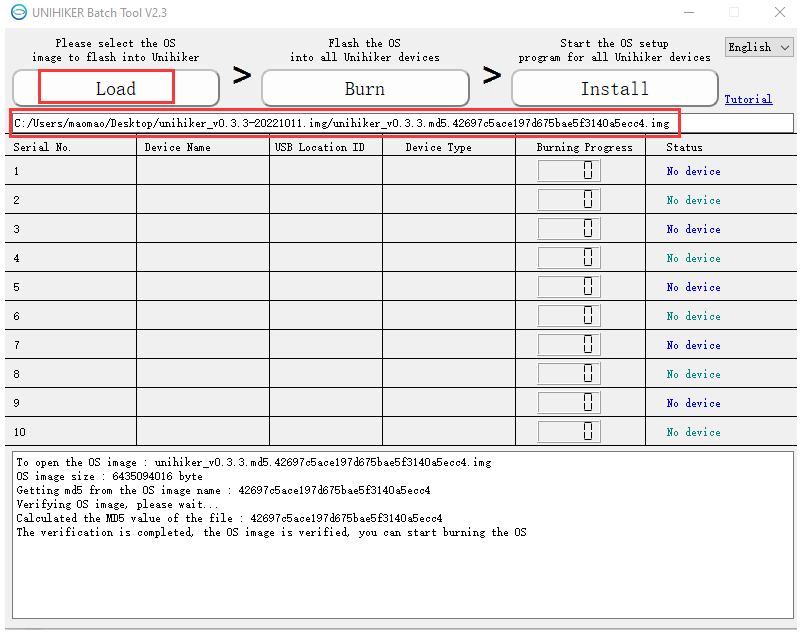
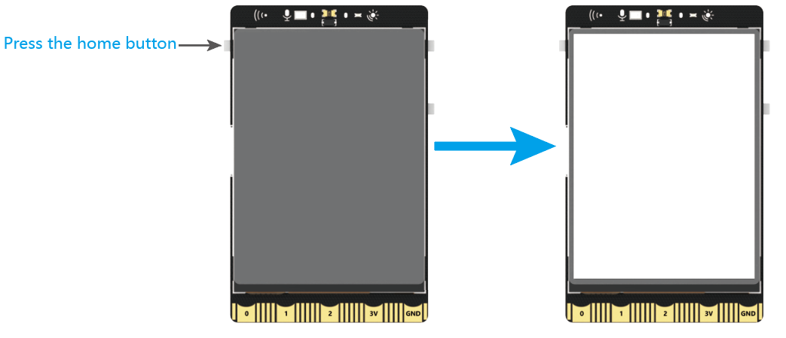
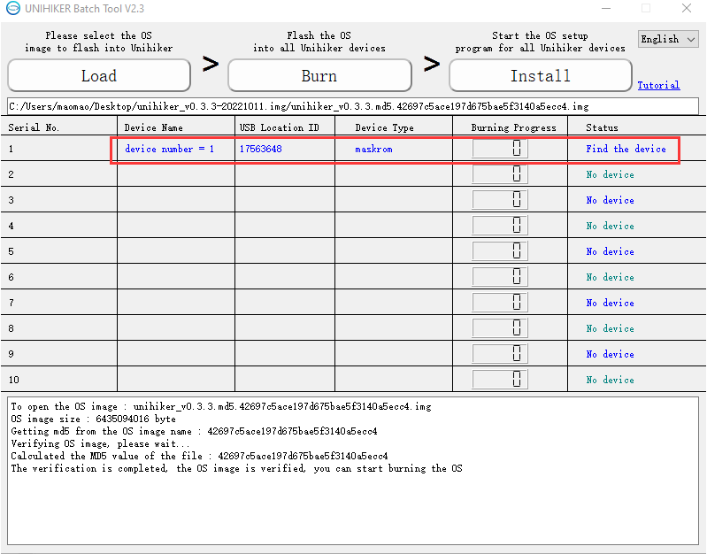
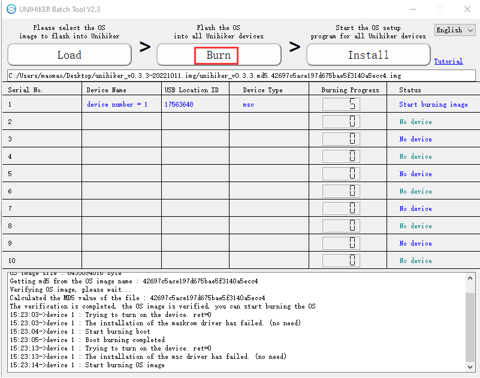
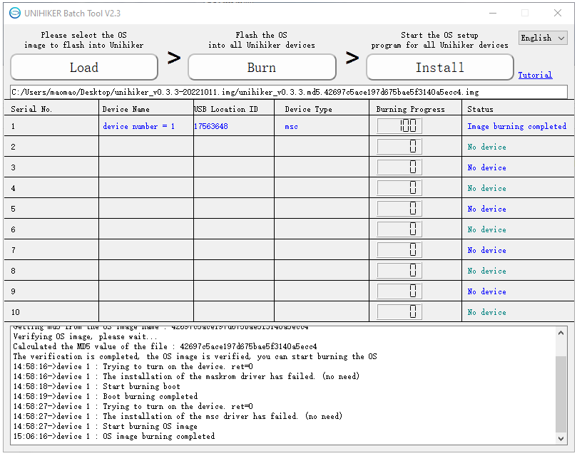
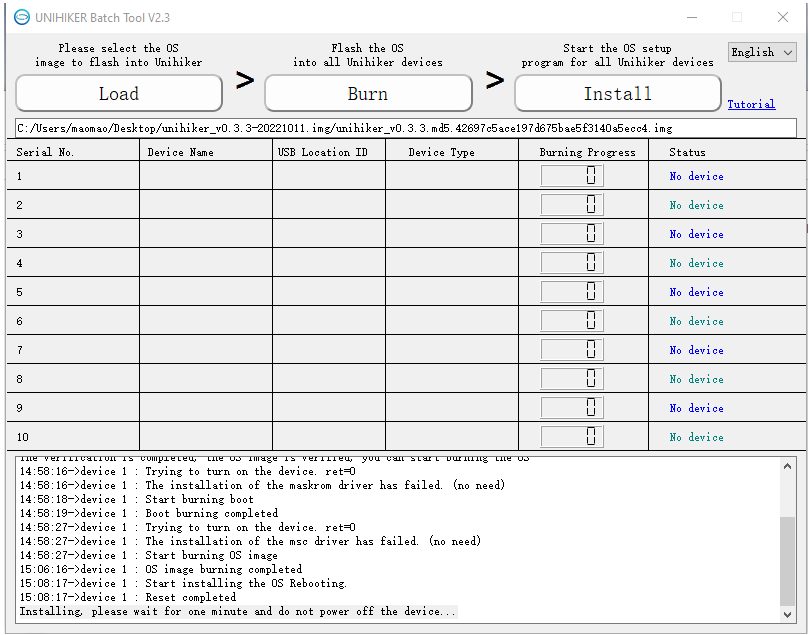
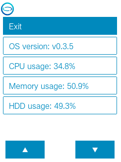
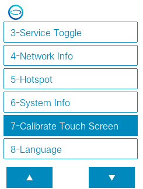
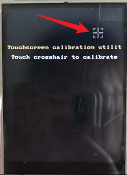

# Burn OS Image 

The UNIHIKER comes with a Linux operating system based on Debian and various built-in features, which will be upgraded from time to time. 

When you need to update your UNIHIKER system to the latest version or to restore a malfunctioning system, you can refer to this article to flash a new OS.

## 1- File Backup
- After re-flashing the OS image, all files in the UNIHIKER, including the root directory, will be cleared and cannot be restored. Therefore, it is recommended to back up the necessary files before the firmware flashing process.
- You can use the **SMB** function to copy personal files (excluding hidden files) in the root directory to your computer, and then copy them back after the OS is refreshed.

## 2- Tool Preparation

1. You need the **UNIHIKER Batch Tool**, a system image burning tool:

> Note: The burning tool has been upgraded to a batch burning tool, which can burn system images to 10 UNIHIKER boards at the same time. Currently, only the Windows version is available.

**Windows version (no installation required, just extract and run):**

- [Click to download](https://download3.dfrobot.com.cn/unihiker/Burner/UNIHIKER_Batch_Tool_20220629_win.zip "Click to download")    

2. Download the system img image file that needs to be flashed. After downloading and extracting it, you will get an img format image file. 

 <big>Note: Please do not use the old version img image file of 0.2.8. The V1.2 or later UNIHIKER board only supports firmware versions V0.3.1 and above. The new version image file contains all the features and additional built-in libraries.</big> 

**Download V0.3.3 System Image**  
Name: unihiker_v0.3.3.md5.42697c5ace197d675bae5f3140a5ecc4.img 
SHA1: 1393bfad3d333b85a593809ec250f8c575b9efdf

- [Click to download](https://download3.dfrobot.com.cn/unihiker/img/unihiker_v0.3.3-20221011.img.zip "Click to download")  

>**OS V0.3.3 ReleaseLogs:**
>
>- The Home menu now displays the external storage folder (media) and can run programs from SD cards or USB drives.
>- The options in the Home menu has been numbered and the position of the hotspot mode switch has been adjusted.
>- Support to click the logo in the terminal interface of the Home menu to return to the menu interface.
>- Fixed the issue of USB network card not being able to be used.
>- Optimized the occasional white screen issue that prevented the system from starting.
>- Other bug fixes and feature optimizations.

## 3- Operation Steps 
3.1- Open the UNIHIKER Batch Tool **UNIHIKERBatchTool.exe**, Click on the **Load** button and select the system image (img) file. The file path will be displayed below. 

  

3.2 Enter firmware flashing mode

- Disconnect the UNIHIKER board from the power source (the memory card also needs to be removed)

- Press and hold the Home button on the board , and connect the board to your computer via USB cable. Then the board will enter the firmware flashing mode and display a white screen. The software should recognize the board as a new device.
- Release the Home button now. If you need to flash multiple boards at the same time, repeat the steps above.

- After the UNIHIKER board to be flashed is recognized, click on **Burn** to start flashing the firmware. If it is the first time connecting, the driver will be installed first.  

- Once all the UNIHIKER boards have reached 100% in burning progress or if some burnings failed (wait for others to complete and then retry burning), click **Install** to install the system. The burning software will control all UNIHIKER boards to restart and install the system.   

 **Start burning:**

**Burning Completed**：

- The system will be automatically installed on the UNIHIKER board, and it will restart several times during the process, which takes about one minute. Finally, it will stably display the UNIHIKER logo. Please do not operate or power off during this process. If an operation is performed by mistake, please re-flash the system.

> Note: During the burning process, check the output information in the lower window. If it gets stuck in a certain step and the progress does not move for more than 5 minutes, please refer to the troubleshooting section at the end of this page for solutions.

**Install System:**  

- After the system is successfully installed and started, the UNIHIKER logo will appear. Press the **HOME** button to enter the **HOME menu**. Use the **A and B** buttons to move the cursor up and down, and use the **HOME** button to confirm. Enter to check the **system information**, and check whether the system version is the version of the system image that was just installed, if so, it means the system image has been successfully burned. 

- After flashing the system, the touch screen needs to be re-calibrated before use. Select **Calibrate touch screen** in the **HOME** menu, and the screen will display five touch points in sequence. Click on each touch point, and the system will restart to complete the calibration.

  
  
  
  

## FAQ

| Q | If the device to be burned is not displayed, what should I do? |
| ------------ | ------------ |
| A | First, make sure your computer can access the UNIHIKER board correctly. When the board is powered on normally and displays the logo on the screen, you should be able to access the board's webpage menu by entering 10.1.2.3 in your web browser. Then, make sure to follow the steps for burning the system image carefully. It's important to turn off the board and disconnect it from power first, then press and hold the Home button before connecting the USB cable to the PC to let the board enter system image burning mode. |

| Q | The system burning is complete and the progress reaches 100%, but the UNIHIKER still cannot boot up after one minute. |
| ------------ | ------------ |
| A | Maybe the system file is not fully downloaded. You can verify the SHA1 with this document or try downloading the file from a different source. |

| Q | What should I do if I get stuck at the "Starting" or "Installing Driver" step for more than 5 minutes? |
| ------------ | ------------ |
| A | Restart the burning tool and try burning again. If it still exists, power off the board and re-enter the burning mode, then restart the burning tool to burn. 

If you encounter any issues that cannot be solved during use, please feel free to contact us through either of the methods listed below:

1. Send emails to our mailbox: unihiker@dfrobot.com
2. Join our UNIHIKER  channel by the link https://discord.gg/rvvfNCvBKv. 

