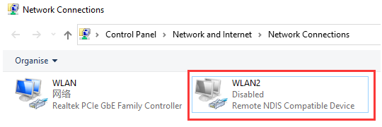
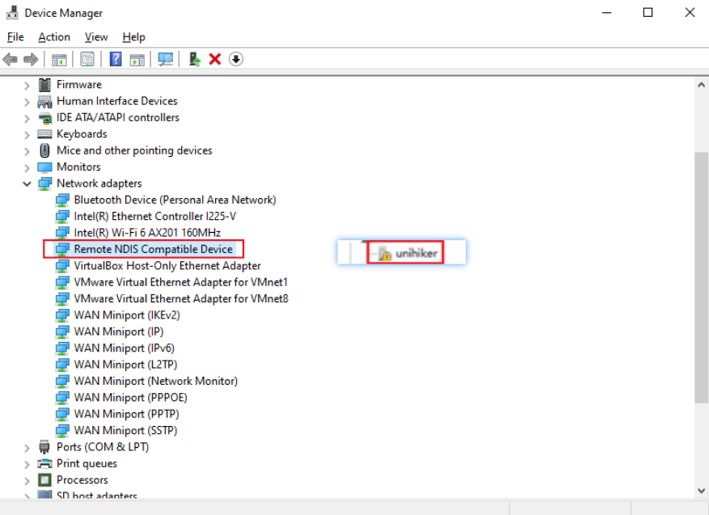
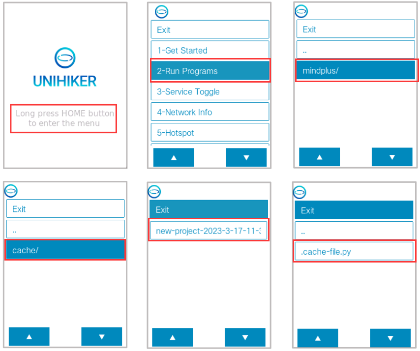
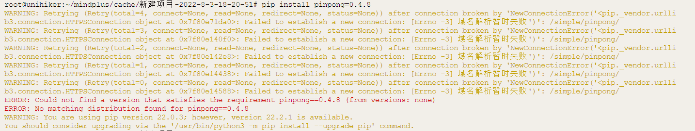
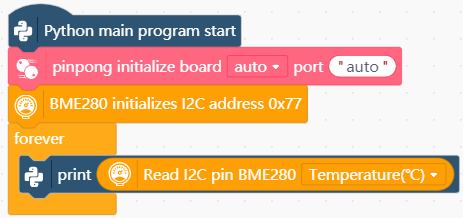
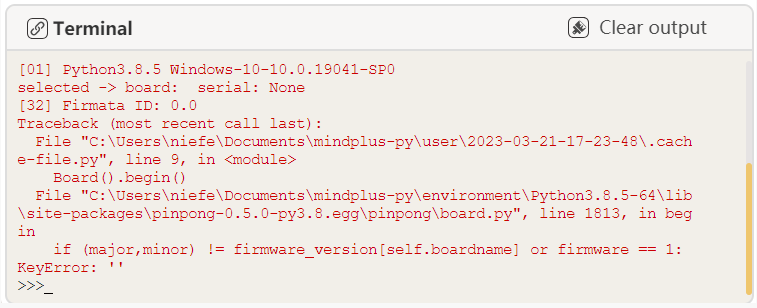
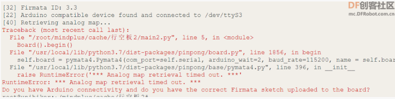
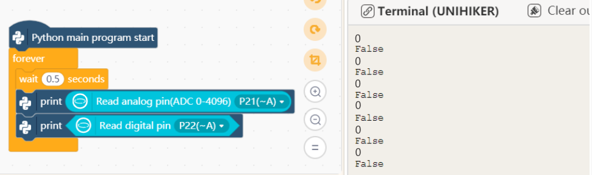

# UNIHIKER FAQs 
<font color="red">
<big>This FAQ page is designed to help users quickly solve some frequently-asked questions when using the UNIHIKER. <br>Please refer to the<strong> Category </strong>on the left to see which<strong> category</strong> your problem falls under, or press <strong> CTRL+F </strong> to search the relevant keywords to look for the answer to your question. <br>If you cannot find any solutions to your problem, please email us at unihiker@dfrobot.com, or scan the QR code below to join the UNIHIKER  communication channel</big>
</font>


## ----------


## 1- Connection & OS


## |- How to connect ?

| Q | How do I get my UNIHIKER connected to a WiFi Internet? |
| ------------ | ------------ |
| A | You can click **Local Webpage Service** to view how to connect your UNIHIKER to the Internet through UNIHIKER's local webpage. Or you can enable the hotspot of the UNIHIKER and connect your mobile phone to the hotspot, and then enter the local webpage to get UNIHIKER connected to a WiFi. |

---

## |- The UNIHIKER cannot be connected to Mind+ 

- **Q:**  Why Mind+ cannot connect to 10.1.2.3 after I connect the UNIHIKER to my PC via USB and the UNIHIKER logo appears?  
|
- **A:**  **1.** First, open the **Network Connections** to check if there is an **enabled unrecognized Remote NDIS network**. If it shows **Disabled** or does not exist, **check if the USB cable is directly plugged into the computer's USB port without using any extension cables or docking station connectors**.<br><br />2. **If the wiring is correct and the UNIHIKER has done booting, open the Device Manager to check** if there is an unknown device named "unihiker" with a yellow exclamation mark. **If so, it means that the current system lacks the relevant driver and you need to install it manually.** Installation method:<br>**a.** [[Download the driver package]](https://img.dfrobot.com.cn/wiki/none/3bea578f7062b725bbde9f383d8fbb16.zip "[点击下载驱动包]") and unzip it to the desktop.<br>**b.** Double-click on "unihiker" in the Device Manager, click **Update driver**, select **Browse my computer for driver software**, click **Browse**, and select the driver package folder that is downloaded and unzipped to the desktop. Then click **Next**, at this time a prompt may appear, just click **Install this driver software anyway**, and wait for the installation to complete. When the prompt **Windows has successfully updated your driver software** appears, it indicates that the installation was successful.<br>**c.** Replug the UNIHIKER, and you will see an **RNDIS device** under **Network Adapters** in the Device Manager after the UNIHIKER is rebooted. When you open the **Network Connections**, you will see an **RNDIS** device. At this point, you can access 10.1.2.3 normally. If the connection still fails, please let us know.<br><br><br> 

---

| Q  | What should I do if I cannot open the UNIHIKER Local Webpage on my browser or if it gets blocked? |
| ------------ | ------------ |
| A | Check the browser kernel mode, select **Extreme mode**, or try it on the Chrome browser. <br/>If the network in the computer room is shut down, you need to add the website address ```10.1.2.3:80``` to the white list. |

## |- How to update the system time if the SIOT time is incorrect

| Q | Why the time for SIOT data is not the current time? How to update the system time? |
| ------------ | ------------ |
| A  | UNIHIKER is equivalent to a computer with a Linux system, so it will automatically adjust the time after connecting to the network. |

## |- How to shut down

| Q | Do I need to use a specific command to shut down UNIHIKER? |
| ------------ | ------------ |
| A  | You can simply disconnect the power to shut down UNIHIKER. |

## |- How to connect a Bluetooth speaker

| Q  | How to connect a Bluetooth speaker to UNIHIKER? |
| ------------ | ------------ |
| A  | Please refer to the tutorial: [click here](https://mc.dfrobot.com.cn/thread-313366-1-1.html) |

## |- How to choose an expansion board for UNIHIKER

| Q  | What expansion boards can be used with UNIHIKER? |
| ------------ | ------------ |
| A  | The UNIHIKER's pins are compatible with micro:bit, so you can use micro:bit expansion boards with it. (Note: Please make sure that there is no mechanical conflict when using horizontal expansion boards.) |

## |- What should I do if the screen is black/white and I can't enter the system?

| Q  | What should I do if the UNIHIKER's screen remains black after powering it on for 10s? |
| ------------ | ------------ |
| A  | 1. Check the POWER and USER lights on the back of the UNIHIKER. If the POWER light is not on, it means that the board is not powered, and you need to check whether the USB port is working, try changing the USB port or the USB cable. Additionally, make sure that the UNIHIKER is directly connected to the USB port of a PC or a power bank via a USB cable without an extension cable or docking station. <br />2. If the POWER light is on, check the USER light. If the USER light is not flashing, it means that the system has not started successfully. Try replugging the USB cable. If the problem persists, try **brun OS image** to UNIHIKER again. </br><br />3. If the POWER light is constantly on, the USER light is flashing, but the UNIHIKER's screen is still black, try **brun OS image** to UNIHIKER. If the problem persists, join the UNIHIKER overseas official channel or contact the purchase channel for technical support. |

| Q  | The sound volume is too low when playing audio files. |
| ------------ | ------------ |
| A | You can adjust the system volume using the ```alsamixer``` command. |

| Q | How can I adjust the screen brightness of UNIHIKER? |
| ------------ | ------------ |
| A | You can use the ```brightness xx``` command to adjust the brightness.  |


## |- How can I get the Mind+ graphical program to run on the UNIHIKER after disconnecting it from my computer?

| Q  | How can I get the Mind+ graphical program to run on the UNIHIKER after disconnecting it from my computer? |
| ------------ | ------------ |
| A  | When you click on **Run** in Mind+, Mind+ will upload the generated Python codes when coding in block mode (including all contents in the **File in the project**) to the **mindplus** folder (named after the file name displayed in the top bar on Mind+) **in the UNIHIKER**. So you can find the corresponding project in the **mindplus** folder in the UNIHIKER's **Home menu**. The **.cache_file.py** is the program generated from the blocks.|

<br>  


## -How can I upload resource files (such as images) required for my program to UNIHIKER?

| Q  | How can I upload resource files (such as images) required for my program to UNIHIKER? |
| ------------ | ------------ |
| A  | You can open **File System** on Mind+ and simply drag and drop the required files into the **File in the project**. When you click **Run**, Mind+ will upload all files in the **File in the project** to the mindplus folder in UNIHIKER for execution. |


## ----------

## 2- Errors During Execution  

## |- Error: python3: can't open file...

| Q  | The UNIHIKER automatically runs a program after being powered on for 5s or reports a "can't open file" error? |
| ------------ | ------------ |
| A | There is an **Auto boot** function in the **Service Toggle**. If it is enabled, then UNIHIKER will automatically run the program that was run last time when powered on. If the program set to automatically start on boot is deleted, an error such as `python3: cannot open xxxx.py` or `python3: can't open file '/root/xxx':[Errno 2] No such file or directory` will be reported at startup. At this time, simply run any program in the **Run Programs**, or disable the **Auto boot** function. |

## |- Installing Python library failed, Warning: Retrying...[Errno -3]

| Q  | What should I do when the warning "WARNING: Retrying... [Errno -3]" appears while installing a library on UNIHIKER? <br/> |
| ------------ | ------------ |
| A  | This indicates that UNIHIKER is not connected to the network. Please connect it to the network first. If the error persists after connecting to the network, try switching the Python source or changing the WiFi. |

| Q  | What should I do if the Python code cannot be stopped after running? |
| ------------ | ------------ |
| A  | You can use the Ctrl+\ in the terminal to forcefully kill the process, or long-press the Home button on UNIHIKER for over 5s to terminate all Python programs. |

| Q  | How to use OpenCV to scale up or down the image captured by cameras and display it on the UNIHIKER screen？ And how to rotate the camera image to display it horizontally? |
| ------------ | ------------ |
| A  | [Please refer to the tutorial](https://mc.dfrobot.com.cn/thread-312867-1-1.html) |

---

## |-Error: 'NoneType' object has no attribute 'boardname' 

| Q | What does it mean when the error "AttributeError: 'NoneType' object has no attribute 'boardname'" is reported while running a program in Mind+? |
| ------------ | ------------ |
| A  | That means the pinping initialization block is missing. You need to load the pinpong initialization function and initialize pinpong before using a sensor.<br><br />|


 

---

## |-Error: firmware_version[self.boardname]:KeyError:  

- **Q:**  What does the error "if (major,minor) != firmware_version[self.boardname]:KeyError: ''mean?<br><br /> 
- **A:**   That means no main controller is detected. Please check if the main controller is connected properly. 

---

## |-Error: RuntimeError: Analog map retrieval time out. or the readings from onboard components all 0

- **Q:** What should I do when the error message "RuntimeError: Analog map retrieval time out" appears or the readings from onboard components are all 0.?<br>
 <br> or<br /><br /> 
-  **A:**  You can refresh the co-processor firmware to solve the problem by referring to this tutorial: [Click to view](https://mc.dfrobot.com.cn/thread-314045-1-1.html "[点击查看]"). 

---

| Q | How can I display flip text on the UNIHIKER screen? |
| ------------ | ------------ |
| A  | You can use the PIL library to achieve this. Refer to this tutorial: [click to view](https://mc.dfrobot.com.cn/thread-315201-1-1.html) |

| Q | How to use a third-party font library to display dot-matrix text on UNIHIKER? |
| ------------ | ------------ |
| A  | You can load the third-party font library file. Please refer to this tutorial: [click to view](https://mc.dfrobot.com.cn/thread-313952-1-1.html) |

| Q | The error message "IndentationError: unexpected indent" is reported during running a program. |
| ------------ | ------------ |
| A  | This error indicates that there is an indentation error. Check the code before and after the error line to see if there are any extra or missing spaces. |


## ----------

