# Getting Started with UNIHIKER
The UNIHIKER is an innovative open-source hardware designed to facilitate Python learning and usage. Featuring a **single-board computer** architecture, it boasts an integrated LCD color screen, WiFi Bluetooth, various commonly used sensors, and a rich set of expansion interfaces. **Equipped with a Linux operating system and Python environment**, the board also provides pre-installed frequently used Python libraries, making it ideal for educators and students looking to start their Python programming journey with only two easy steps!

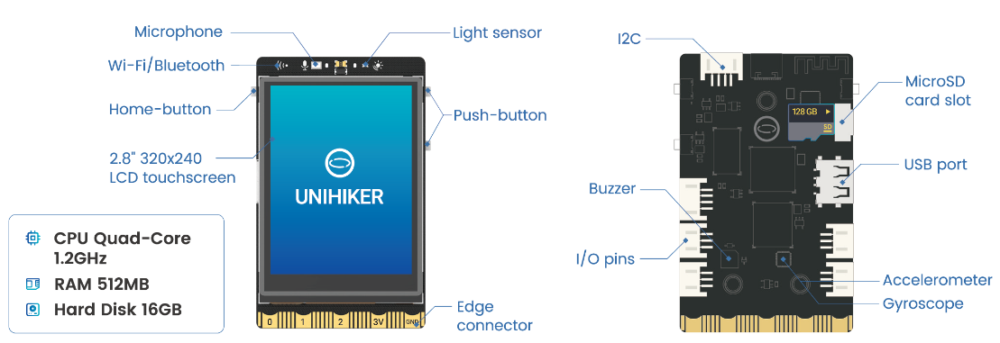

## 1. Quick Start Tutorial

- This tutorial will help you quickly get started on controlling the UNIHIKER with Python code through a few simple steps.  

- If you encounter any issues during use, please feel free to contact us through either of the methods listed below:
  - Join our UNIHIKER channel by scanning the QR code below or clicking the link https://discord.gg/rvvfNCvBKv.  
    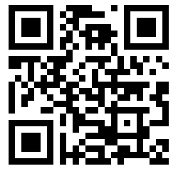
  - Send emails to our mailbox: unihiker@dfrobot.com
## 2. Preparation

- UNIHIKER * 1
- Type-C to USB cable * 1
- PC * 1

## 3. Starting up

Connect the UNIHIKER to your computer via the Type-C to USB cable. Once connected and powered on, the UNIHIKER logo will appear on the screen. At this time, the computer will automatically recognize the UNIHIKER as an network device,  and you can access it directly through the fixed IP address 10.1.2.3.

> Note: Please ensure that you plug the USB cable directly into the computer's USB port without using an extension cord or dock. If you experience any issues with the connection, please refer to the FAQ for a solution.


## 4. Programming Platform Selection
As a single-board computer, the UNIHIKER board can run Python code directly. It also enables the ssh and samba file-sharing services by default, so you can use any text editor to write code and transfer it to the board for execution.

-  For **beginners**, it is recommended to program the UNIHIKER on Mind+(Similar to scratch), which supports one-click connection, file management, and block & code programming modes.   

- Users with Python experience can choose a programming platform that suits their habits, such as [jupyter notebook](https://wiki.unihiker.com/jupyter "jupyter notebook"), [vscode](https://wiki.unihiker.com/vscode "vscode"), [thonny](https://wiki.unihiker.com/thonny "thonny"), or Mind+.

- Users with experience in Linux-based development boards can refer to the **ADVANCED FEATURES** and operate according to their habits.   

  **Here we will show how to write a simple hello world program on Mind+ and Jupyter, the two commonly used programming platforms. For other methods, please refer to the advanced tutorial.**

---

## 4.1. Programming on Mind+
1. Download the Mind+ application that supports UNIHIKER **(V1.7.2 RC3.0 or above)**. [[Dowload Mind+ from the official website]](https://mindplus.cc/download-en.html "[Dowload Mind+ from its official website]") 
2. Open Mind+ and switch to **Python mode**. 


> Mind+ supports programming by graphical blocks and Coding. You can choose as per your needs.


### 4.1.1. Graphical Blocks
Switch to **Blocks**.  

1. Load the **extension library of UNIHIKER**. Click **Extensions** to load **UNIHIKER**, then return to the programming page, and you can see the UNIHIKER blocks and the **Connect Remote Terminal** item.

   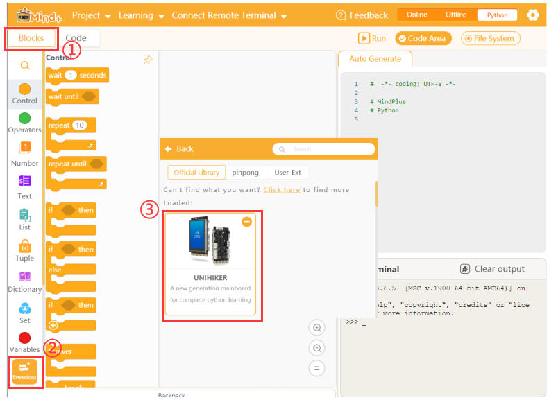

2. Drag blocks to program. The code to be written is shown below:

   

3. Connect to the UNIHIKER. After a successful connection, Mind+ will automatically detect the Python libraries inside the UNIHIKER(such as pinpong, SIoT, etc. If these library versions are outdated, a prompt to upgrade will appear).  

   If you click the run button without connecting to UNIHIKER, the code will be executed on your computer's Python environment and the result will be displayed on your computer. 

   If you want to see the result displayed on UNIHIKER, you need to open the **Connect Remote Terminal** menu in Mind+ and select **10.1.2.3** to connect to UNIHIKER. Then click the run button again, and the result will be displayed on the UNIHIKER screen.

   > **Note: If there is a connection error**, check if the USB cable is connected correctly or refer to **FAQ** for a solution. If the error still exists, join our UNIHIKER channel for assistance.

   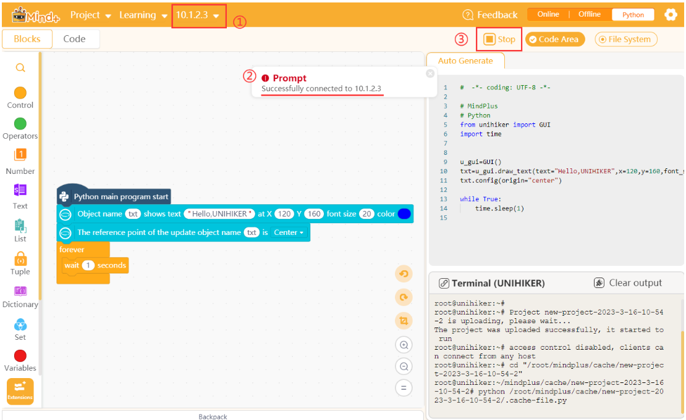

4. Run the code. After connecting to UNIHIKER successfully, click **Run** to upload the code to the board for execution. You can see the running effect on the UNIHIKER screen. 

   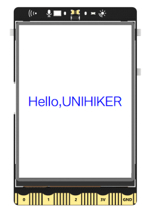


### 4.1.2. FAQ

---

- **Q:**  How to run graphical programs on UNIHIKER? 
- **A:**  Click the button **Run**, and Mind+ will upload the generated Python code when coding by blocks to the **mindplus** folder **in UNIHIKER**. So you can find the corresponding project's .cache_file.py in the folder through the Home menu and run it.
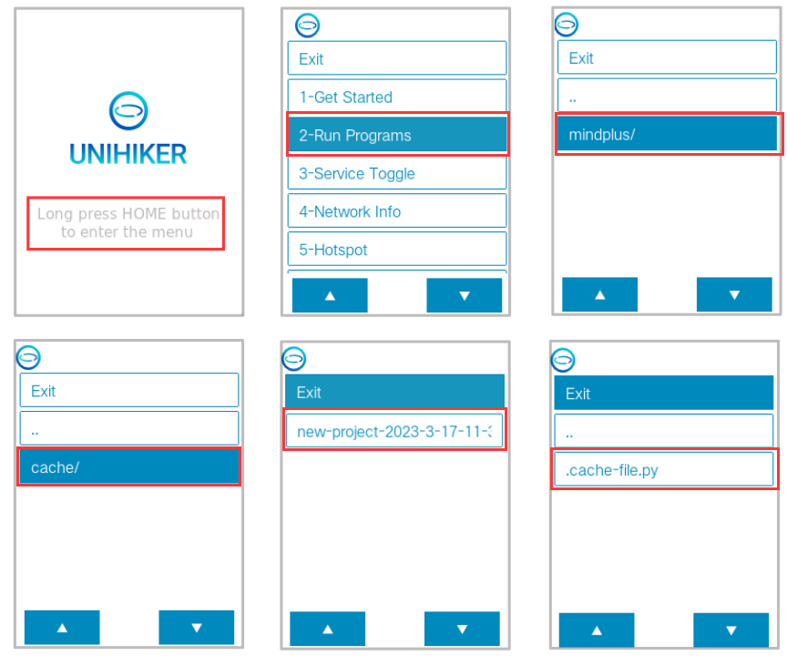 

---

| Q  | How to upload resource files (such as images) to UNIHIKER for use in the program? |
| ------------ | ------------ |
| A  | Open the **File System** in Mind+, drag the file into the **File in the project**, and click **Run**. Then Mind+ will upload all the **files in the project** to the mindplus folder on UNIHIKER for use. |

---

### 4.1.2. Coding 
Switch to the **Code** (default page).  
1. Write the code. Create a new **main.py file** in the **File in the project**, double-click to open, and enter the following code:  
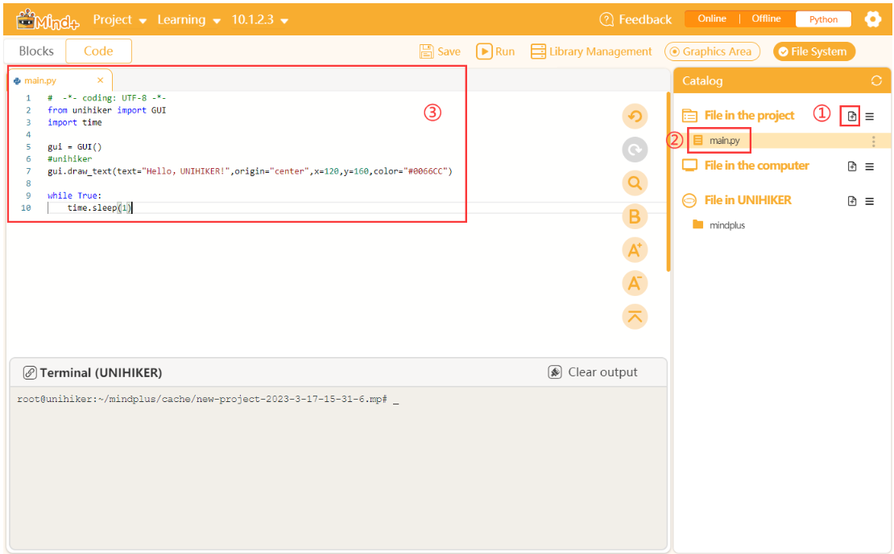

```python
#  -*- coding: UTF-8 -*-
from unihiker import GUI
import time

gui = GUI()
#unihiker library text display
gui.draw_text(text="Hello，UNIHIKER!",origin="center",x=120,y=160,color="#0066CC")

while True:
    #Keep the program running
    time.sleep(1)
```


2. Connect to the UNIHIKER. If you click Run directly, the code will run on your PC's Python environment. If you want to run it on the UNIHIKER, you need to connect to it. Click the icon before the **Terminal** to activate the **Connect to Remote Terminal** menu, and then click **10.1.2.3** to connect to the UNIHIKER.
   
    > **Note: If there is a connection error**, check if the USB cable is connected correctly or refer to **FAQ** for solutions. If the issue still exists, join our UNIHIKER official channel for assistance. 

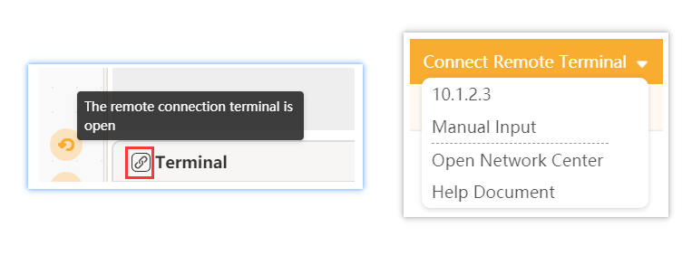

Once UNIHIKER is connected, the **File in UNIHIKER** will be displayed in the **File Catalog**, the terminal will switch to the **remote terminal of UNIHIKER**, and the library management will switch to the **library management of UNIHIKER**.  
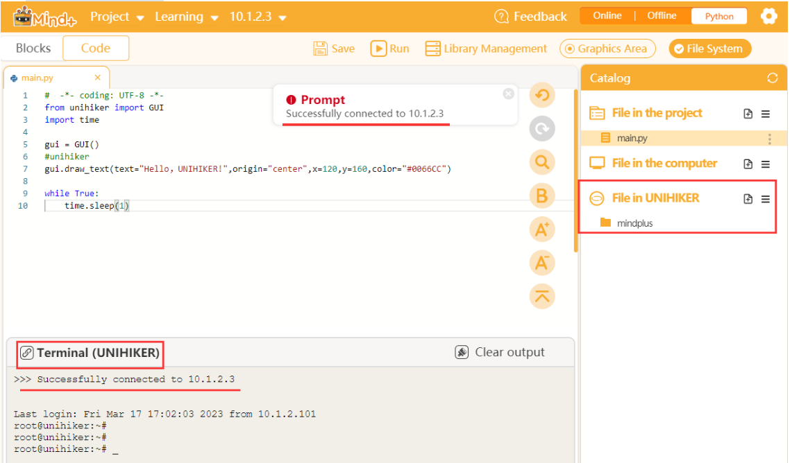


3. Run the code. After the UNIHIKER is successfully connected, click Run and Mind+ will upload the code to the board and run it. You can see the running effect on the screen.
   
    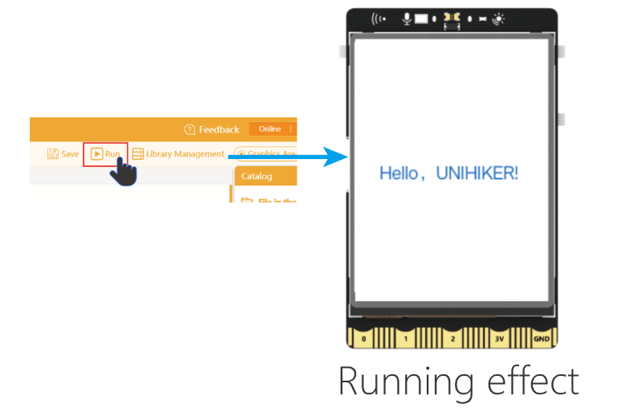
    
    Note: The code actually exists on the PC here. When you save the project, **all the py codes or image resources contained in the project file** will be packaged into the .mp file for easy transmission. In the UNIHIKER's Home menu, you can find the  .mp package in the **mindplus** folder in **Run Programs**. Click it and you can run the code directly without connecting to Mind+.  


---

## 4.2. Programming on Jupyter
> The UNIHIKER features built-in Jupyter service but it is disabled by default. Enable it and then you can directly program UNIHIKER on a web page.

1. Open a browser (not IE), and enter the website address **10.1.2.3** to access the local web page menu on the UNIHIKER.
   
   > **Note: If there is a connection error**, check if the USB cable is connected correctly or refer to **FAQ** for a solution. If the issue still exists, join our UNIHIKER official channel for assistance.]
   > Note: You can also directly enter the Jupyter page by inputting **10.1.2.3:8888** (require enabling Jupyter service first).
   >   
   
2. Select the **Service Toggle**, and check the  **status** of the **Jupyter**. If it is **disabled**, click **Start** and wait until the status changes to be **Enabled**, then click **Open Page** to access the Jupyter programming page.  
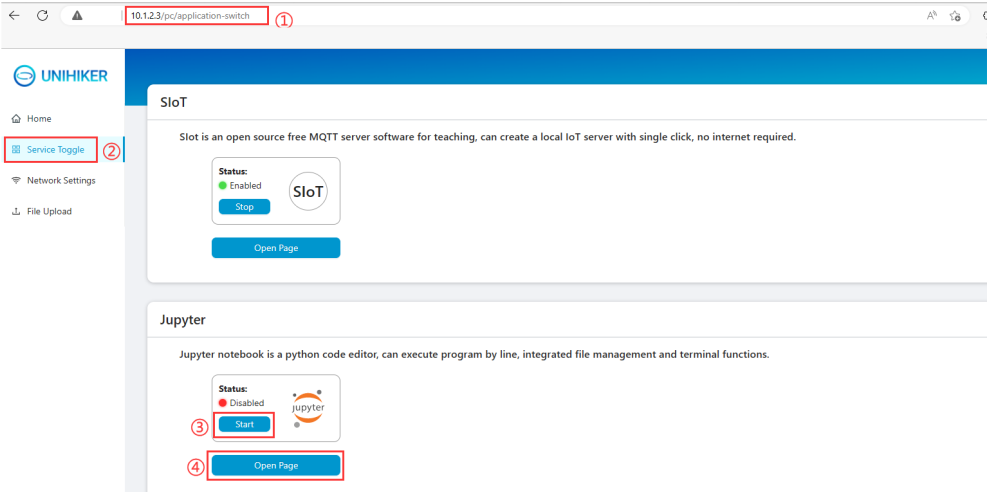

3. Create a new project. Once Jupyter is enabled, click **New** > **Python 3 (ipykernel)** and you can create a Jupyter project.  
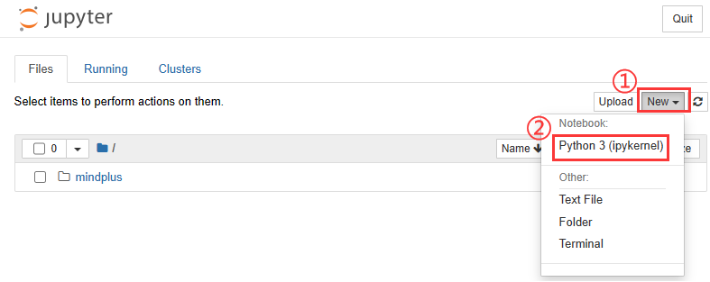

4. Program and run the code. Enter the code, and click **Run** to see the results displayed on UNIHIKER screen. Click **interrupt kernel** or **Kernel** > **Restart** and you can end the program.  

```python
#  -*- coding: UTF-8 -*-
from unihiker import GUI
import time

gui = GUI()
#unihiker library text display
gui.draw_text(text="Hello，UNIHIKER!",origin="center",x=120,y=160,color="#0066CC")

while True:
    #Keep program running
    time.sleep(1)
```


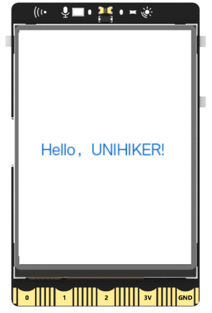


- If you encounter any problems during use that you cannot resolve, we recommend joining our UNIHIKER channel for help.  
  
- More tutorials are coming soon. Welcome to our [Education community](https://edu.dfrobot.com/ "EDUCATION") to stay up-to-date with the latest tutorial. 

