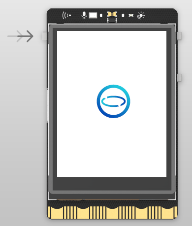
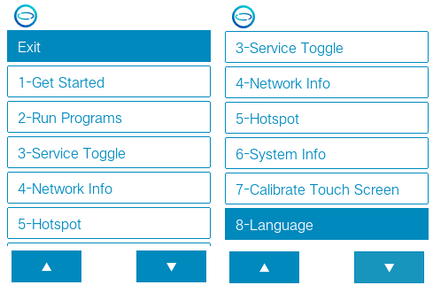
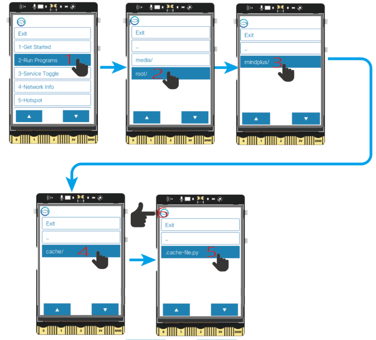
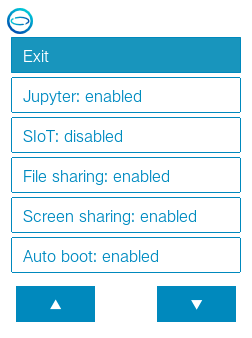
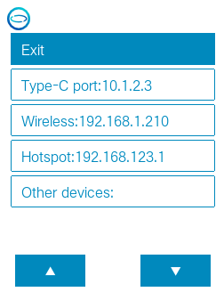
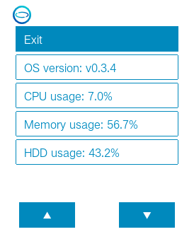
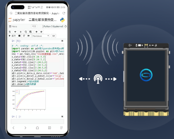
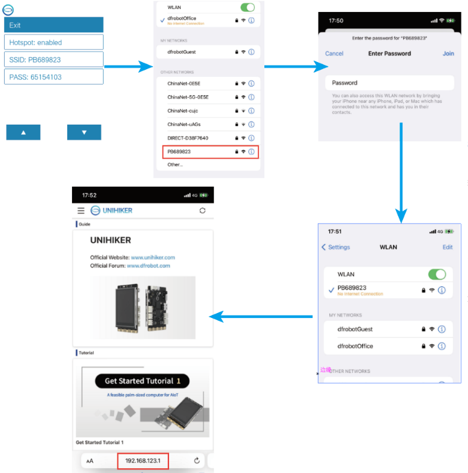
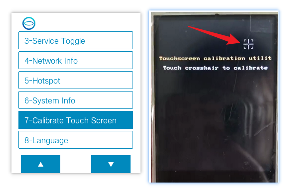

# UNIHIKER Home Menu
To facilitate use, the UNIHIKER has a HOME menu that can be accessed by long-pressing the Home button. Move the cursor up and down by the button A and B, and confirm by the Home button.

  

The Home menu on the UNIHIKER provides convenient access to commonly used features for controlling the board:

- Switching between running programs
- Service Toggle 
- Viewing network information
- Enabling/disabling hotspot mode
- Calibrate Touch Screen



## Run Programs
In this option, all Python programs located in the system file directory are displayed. Selecting a program and pressing the Home button will start running it. To exit a running program, press and hold the Home button. 


## Service Toggle 
This menu provides the functionality to control the built-in applications:

- Jupyter: Turn on/off Jupyter Python editor service, which is off by default.
- SIoT: Turn on/off SIoT IoT server, which is on by default.
- File sharing: Turn on/off Samba file sharing, which is on by default.
- Screen sharing: Turn on/off VNC screen sharing, which is on by default.
- Auto boot: When turned on, the board will automatically run the program that was last run before shutdown. This function is off by default.

> Note: If the program set to automatically start on boot is deleted, an error message such as ```python3: cannnot open xxxx.py``` or ```python3: can't open file '/root/xxx':[Errno 2] No such file or directory``` will be displayed at boot. To resolve this issue, run any other program in the **Run Programs** menu or turn off the autostart feature.



## Network Info
This menu option allows users to check the network IP:
- USB Ethernet: Displays the IP address of the board when connected to a computer via USB, which is fixed at 10.1.2.3.
- Wireless Connection: Displays the IP address assigned to the board by the router when connected to other WiFi hotspots.
- Wireless Hotspot: Displays the IP address of the board when the UNIHIKER is in wireless hotspot mode, which is fixed at 192.168.123.1.
- Other Devices: Displays the IP address assigned to the board when connected to other network devices, such as network card, which is assigned by the router.



## System Info 
The system-related information can be found here:
- System Version: Displays the current system version.
- CPU Usage: Displays the current CPU usage.
- Memory Usage: Displays the current memory usage.
- Disk Usage: Displays the current disk usage.



## Hotspot 


This menu option allows you to turn on/off the wireless hotspot on the UNIHIKER board. When it is turned on, the SSID and password will be displayed on the screen, and other devices can search for and connect to this hotspot. 

> **Note** that because the UNIHIKER itself is not connected to the Internet, it can only be used for local area network (LAN) purposes. Therefore, when other devices connect to its hotspot, they will lose Internet connectivity, and the only accessible IP address will be 192.168.123.1.




## Calibrate Touch Screen
The UNIHIKER screen is a resistive touchscreen. If you experience inaccurate touch response, you can recalibrate it.

Click on **Calibrate Touch Screen**, and the screen will display five calibration points one by one. Tap (using your fingernail) each of the five points in sequence, and the system will restart once the calibration is complete.

  


## Enable/disable the HOME menu
The HOME menu runs as a service, so it can be stopped.

> Note: Please do not operate this unless necessary.

```bash
systemctl --user start PyboardUI  #enable 
systemctl --user stop PyboardUI  #disable 
systemctl --user restart PyboardUI  #restart 
```