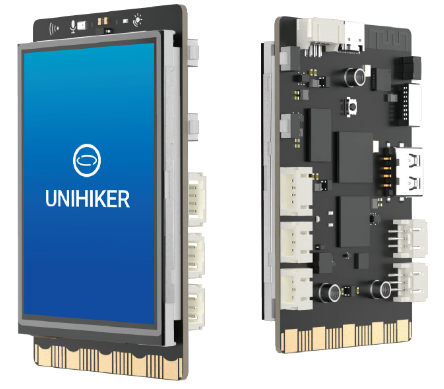

# 1- Introduction 

The UNIHIKER is an innovative open-source hardware designed specifically for learning and using Python. It features a single-board computer architecture with an integrated LCD color screen, WiFi and Bluetooth, various commonly used sensors, and rich expansion interfaces. Additionally, it comes with a Linux operating system and Python environment pre-installed with commonly used Python libraries, which allows educators, students, or makers to step on a Python journey in just two simple steps. 

# 2- Features

- **Supports running Python** instead of MicroPython

- **Pre-installed Linux system**, with ready-to-go Python and commonly-used libraries. Get started with Python in two steps

- **Multiple ways available for connecting**, start coding at anytime anywhere 

- **Highly-integrated hardware** for teaching scenarios 

- **Rich interfaces**, excellent  software compatibility & expandability

# 3- On-board Components 

>  The UNIHIKER integrates commonly used components and provides rich external interfaces, which not only offer high convenience but also have unlimited expandability possibilities.

  

# 4- UNIHIKER System Framework

> UNIHIKER adopts a PC and microcontroller dual-processor architecture. The CPU, memory, hard disk, screen, and peripherals constitute a computer system for running the Linux operating system. The microcontroller is responsible for controlling onboard components and external IO ports. The computer system controls the co-processor through the pinpong library. 

# 5- Specification

> Core 

| Function          | Description                                           |
| ----------------- | ----------------------------------------------------- |
| CPU               | RK3308 Arm 64-bit 4-core 1.2GHz                       |
| Memory            | 512MB DDR3                                            |
| Hard Disk         | 16GB eMMC                                             |
| OS                | debian 10                                             |
| Wi-Fi & Bluetooth | RTL8723DS 2.4G&4.0                                    |
| Co-processor      | GD32VF103C8T6 RISC-V  108MHz & 64KB Flash & 32KB SRAM |

> Onboard Components 

| Function             | Description                                                |
| -------------------- | ---------------------------------------------------------- |
| Button               | Home, A/B                                                  |
| Screen               | 2.8-inch touchscreen color display with 240x320 resolution |
| Microphone           | Capacitive silicon microphone                              |
| Light sensor         | PT0603 Photosensitive triode                               |
| Buzzer               | Passive buzzer                                             |
| LED                  | Blue LED                                                   |
| 6-axis Motion Sensor | 3-axis accelerator and 3-axis gyroscope (ICM20689)         |

> Interface 

| Function        | Description                                                  |
| --------------- | ------------------------------------------------------------ |
| USB Type-C      | Connect CPU to a PC for coding;  supply power for mainboard  |
| USB TYPE-A      | For connecting USB peripherals                               |
| Micro SD Socket | Expanding storage space                                      |
| 3Pin I/O        | Support 3 10-bit PWM and 2 12-bit ADC                        |
| 4Pin I2C        | Independent I2C channel, not shared with onboard I2C components |
| Edge Connectors | Pin numbers are compatible with micro:bit, 19 independent I/O (Support 1 ×I2C, 1×UART, 2×SPI, 6×12-bit ADC, 5×10-bit PWM) |

> Power Supply 

| Function              | Description                                                  |
| --------------------- | ------------------------------------------------------------ |
| Power Supply          | Type-C 5V Power supply (Note: It can only be powered by Type-C) |
| Operating Voltage     | 3.3V                                                         |
| Max Operating Current | 2000mA                                                       |

# 6- Board Overview 

> The image shows the onboard components that are connected to the co-processor and demonstrates interface functions. 
> Note: The edge connector on the back has no electrical connection.

# 7- Dimension 

> Key dimensions for the UNIHIKER. Unit: mm
>
> 

# 8- SVG & 3D File

- 1- Front and back high-resolution SVG vector graphics for the UNIHIKER: [Click to download](https://img.dfrobot.com.cn/wiki/none/a868d4a1a292b44a2030da917feeabd2.zip "Click to download")   

>

- 2- 3D STEP File for the UNIHIKER: [Click to download](https://img.dfrobot.com.cn/wiki/none/064ac0cf8fd9fcb04a6b4adc3f4f4051.zip "Click to download")  

> 

# 9- Technical Discussion 
Community：[**EDUCATION  Community**](https://edu.dfrobot.com/ "EDUCATION")  
Discord：https://discord.gg/rvvfNCvBKv

