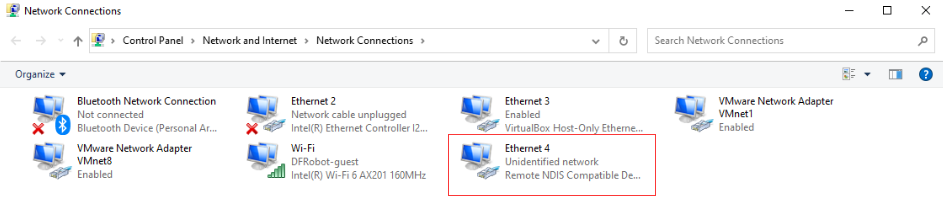
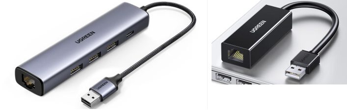
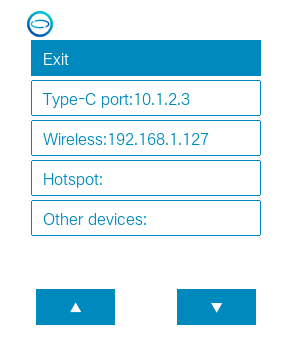

# How to Connect the UNIHIKER 
The UNIHIKER is a single-board microcomputer, so other devices such as smartphones, computers, and tablets can access it for programming or data transmission through the network as long as they are on the same network.

There are multiple ways to connect the UNIHIKER to the network, including USB cable, router WiFi, hotspot mode, and Ethernet cable.

## 1.1- USB 
> It is recommended to connect the UNIHIKER to a computer with a USB cable to get a stable network connection. 
When connecting the UNIHIKER to a computer using a USB cable, the board will be virtualized as an RNDIS network device, and its IP address will be fixed at "**10.1.2.3**". Simply input the board's IP address into the computer, then you can start coding.  

  

## 1.2- WiFi 
The UNIHIKER can be wirelessly programmed by connecting it to WiFi. To do so, connect the UNIHIKER to a router or a mobile phone hotspot (note that 2.4G WiFi should be used), and then connect other programming devices such as a computer, tablet, or smartphone to the same hotspot. Enter the IP address of the UNIHIKER to start programming.
> Note that if both the computer and UNIHIKER are connected to the same WiFi but they still cannot connect, it may be because the WiFi prohibits devices from accessing each other on the network. In this case, try connecting to a different hotspot, such as a mobile phone hotspot, to test.

## 1.3- Hotspot Mode

The UNIHIKER itself can also create a wireless hotspot. Connect other devices (such as a computer, tablet, or smartphone) to this hotspot, and the IP address of the UNIHIKER will be fixed at **192.168.123.1**. Enter this IP address to start programming.   

## 1.4- USB to Ethernet Adapter
The UNIHIKER has a USB interface, so you can use a **USB to Ethernet adapter** to provide the board with a more stable wired network connection or connect to a **network switch in a school computer lab** to interact with a desktop computer. 

## 2.1- How to view IP Address 
Long press the Home button to enter the onboard menu of the UNIHIKER, and enter the **Network Info** interface to view all current IP addresses. 

- Type-C port: Displays the IP address of the board when connected to a computer via USB, which is fixed at 10.1.2.3.
- Wireless: Displays the IP address assigned to the board by the router when connected to other WiFi hotspots.
- Hotspot: Displays the IP address of the board when the UNIHIKER is in wireless hotspot mode, which is fixed at 192.168.123.1.
- Other Devices: Displays the IP address assigned to the board when connected to other network devices, such as network card, which is assigned by the router.

