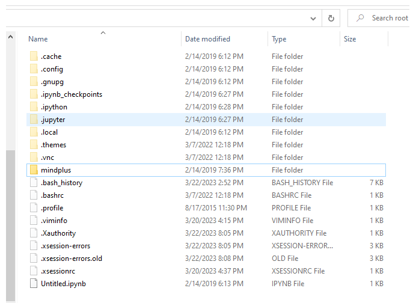

# SMB File Sharing
The UNIHIKER comes with samba service, so you can share files on LAN and create your private cloud drive. 

With the help of the Windows Network Neighborhood function, you can edit files just like managing Windows files.

## How to Enable
You just need to enable the file-sharing function in the Home menu of the UNIHIKER.

## PC Configuration
> First, make sure your PC can access UNIHIKER's webpage menu.

- Open **This PC** .
  


- In the address bar, enter the UNIHIKER's network address in the format of ```\\ip address\```. The IP address is ```10.1.2.3``` when you connect the board to PC via USB cable, then enter ```\\10.1.2.3\```.  The IP address here is ```192.168.199.113```, then enter ```\\192.168.199.113\```. After pressing Enter key, you can see the shared files of the UNIHIKER (for the first connection, input the username and password ```root``` and ```dfrobot``` respectively, and if there is an error, select another account and enter again).  
  

- Or you can also use **Win+R** to open the Run window, and enter the same network address to open the same folder window.  


- The folder named root is the onboard memory space, and the media is the external hard drive space (an SD card inserted into the PC or hard drive connected via USB will be automatically mounted under this folder):  
  

- Double-click the folder to open it. If you are using the IP address ```\\10.1.2.3\```, you can open it directly. If you use other addresses, you may be prompted to enter an access username and password. If so, enter ```root``` and ```dfrobot``` to open it.  
  

- After successfully opening it, you can copy and paste the files normally.
  
  - You can use this method to upload Python code to the board, and then run the program through the Home menu.  
  
    
  
  
  

## FAQ
- Q :  What should I do if an error message "You can't access this shared folder because your organization's security policies block unauthenticated guest access." appears when accessing on Windows?   
 
-  A: Please enable insecure guest logons. 

