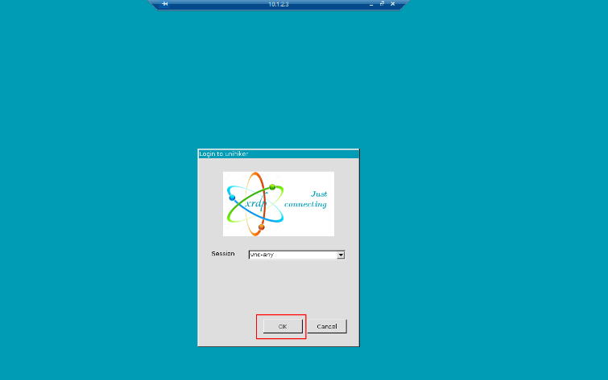

# Remote Desktop (Screen Sharing)

The UNIHIKER comes with enabled remote desktop service, so you can display the board's interface in real-time on your PC, making it convenient for teaching demonstrations or capturing screenshots for tutorials.

There are several software options available for connecting to UNIHIKER, here we will introduce three software: Windows Remote Desktop, MobaXterm, and VNC. 

## Windows Remote Desktop
Windows has a built-in Remote Desktop Connection, so you can use it directly without any additional software required:

1. You can find **Remote Desktop Connection** in Windows by opening the **Start** menu and clicking **Windows Accessories** there, or searching **Remote Desktop Connection** directly. You can also press win+R and type ```mstsc``` in the Run window to open it.

   

2. Enter the UNIHIKER's IP address. In this example, we use the IP address **10.1.2.3** when connected via USB. If you need to enter a username and password, the username is **root** and the password is **dfrobot**.  
   
     
   Once connected, you can minimize the window to a floating window for easy viewing:  
   

   You can right-click on the title bar to choose "Zoom" to enlarge the screen for better viewing:   
   

## MobaXterm
MobaXterm is a multifunctional software that features SSH connection, file transfer, remote desktop, and other functions.

-  After installing MobaXterm, open it and create a new **Session**.  Select **VNC**, and enter the UNIHIKER's IP address to get started. If you need to enter a username and password, the username is ```root``` and the password is ```dfrobot```.


- You can set **Scale by**, **Protocol**, and **JPEG image quality** in **Options**. 


## VNC Viewer
VNC Viewer is a lightweight software for remote desktop viewing.

- After installing VNC Viewer, open it, enter the UNIHIKER's IP address, and type the password ```dfrobot```  
  
